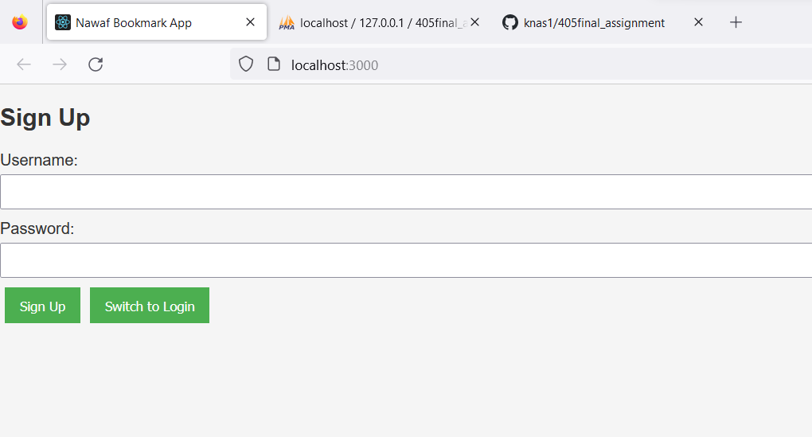
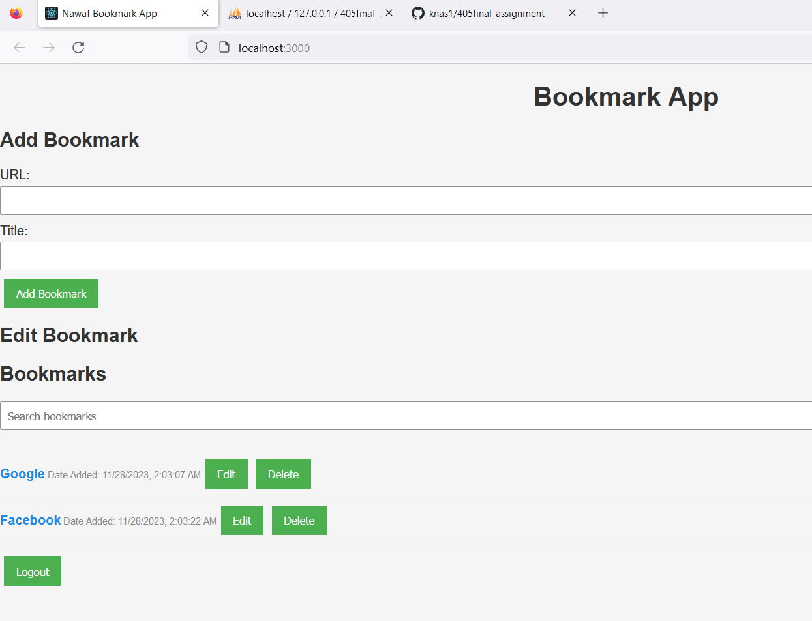
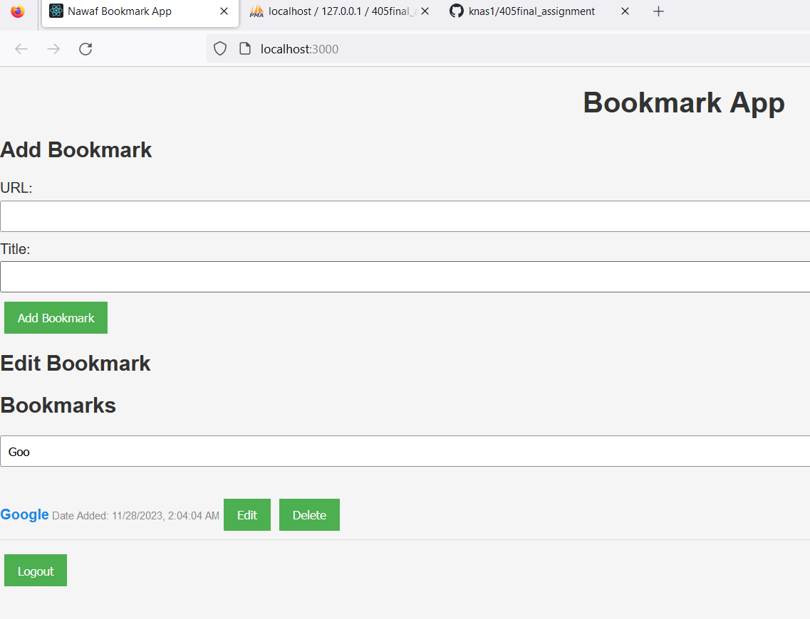
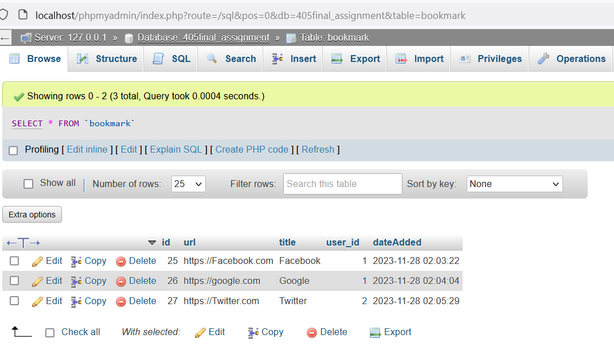
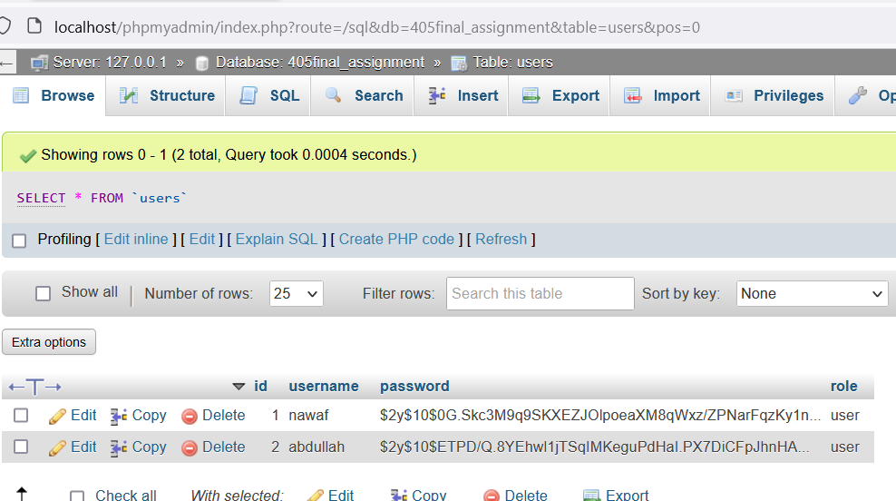

# Nawaf Bookmark App 
# Extra Credit ( Implement user authentication and authorization mechanisms to ensure secure accessto bookmarks. & Implement search functionality to enable users to quickly locate specific bookmarks. )

CPIT-405 Lab Final Assignment

## Screenshots

Signup Page:

Login Page:

Bookmark Page:

Bookmark Page (Search Function):

bookmark table :

users table :

